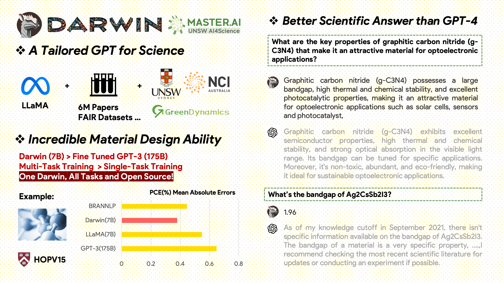

# Darwin: A Tailored GPT for the Scientific Domain 🇦🇺


**Organization: University of New South Wales（UNSW) AI4Science & GreenDynamics Pty. Ltd**

Darwin is an open-source project dedicated to fine-tuning the LLaMA model on scientific literature and datasets. Specifically designed for the scientific domain with an emphasis on materials science, chemistry, and physics, Darwin integrates structured and unstructured scientific knowledge to enhance the efficacy of language models in scientific research.

> **Usage and License Notices**: Darwin is licensed and intended for research use only. The dataset is licensed under CC BY NC 4.0, allowing non-commercial use. Models trained using this dataset should not be used outside of research purposes. The weight diff is also under CC BY NC 4.0 license.

## Model Overview

Darwin, based on the 7B LLaMA model, is trained on over 20,000 instruction-following data points generated by the Darwin Scientific Instruction Generator (SIG) from various scientific FAIR datasets and a literature corpus. By focusing on the factual correctness of the model's responses, Darwin represents a significant stride towards leveraging Large Language Models (LLMs) for scientific discovery. Preliminary human evaluations indicate that Darwin 7B outperforms GPT-4 in scientific Q&A and fine-tuned GPT-3 in solving chemistry problems (gptChem).

We are actively developing Darwin for more advanced scientific domain experiments, and we're also integrating Darwin with LangChain to solve more complex scientific tasks (like a private research assistant for personal computers).

Please note, Darwin is still under development, and many limitations need to be addressed. Most importantly, we have yet to fine-tune Darwin for maximum safety. We encourage users to report any concerning behavior to help improve the model's safety and ethical considerations.

## Model Comparison



## Getting Started

### Installation

Clone the repository and set up the environment:

```bash
git clone https://github.com/MasterAI-EAM/darwin
cd darwin
conda env create -f environment.yml
conda activate darwin
```
### Preparing the Darwin Weights

Download the checkpoints of the Darwin-7B Weights from [onedrive](https://aigreendynamics-my.sharepoint.com/:f:/g/personal/yuwei_greendynamics_com_au/Et4zaC3DLu9JsCAo7dtSJ_gBOtn8hmI3XA0uECKQdfAqkA?e=WO0DpJ). Once you've downloaded the model, you can try our demo:
```bash 
python inference.py darwin_7B
```

Please note, the inference requires at least 10GB of GPU memory for Darwin 7B. We are working on a Colab version of the demo.

## Datasets Information

Our data comes from two primary sources:

A raw literature corpus containing 6.0M papers related to materials science, chemistry, and physics published after 2000. The publishers include ACS, RSC, Springer Nature, Wiley, and Elsevier. We thank them for their support.

FAIR Datasets - We've collected data from 10 FAIR Datasets.

### Data Generation
We developed Darwin-SIG to generate scientific instructions. It can memorize long texts from full literature texts (average ~5000 words) and generate question-and-answer (Q&A) data based on scientific literature keywords (from **[web of science API](https://github.com/Clarivate-SAR/wos-excel-converter))**

> Note: You could also use GPT3.5 or GPT-4 for generation, but these options might be costly.

Please be aware that due to agreements with the publishers, we can't share the training dataset.

## **Authors**

This project is a collaborative effort by the following:

UNSW & GreenDynamics: Tong Xie, Shaozhou Wang, Qingyuan Linghu

UNSW CSE: Cody Huang, Zhenyu Yin

GreenDynamics: Yuwei Wan (CityU HK), Yixuan Liu (University of Melbourne), Mingjin Wu (Nanyang Tech. Uni)

All advised by Bram Hoex and Wenjie Zhang from UNSW Engineering

## **Citation**

If you use the data or code from this repository in your work, please cite it accordingly.

## **Acknowledgements**

This project has referred to the following open-source projects:

- Meta LLaMA: **[LLaMA](https://github.com/facebookresearch/llama)**
- Stanford Alpaca: **[Alpaca](https://github.com/tatsu-lab/stanford_alpaca)**
- gptchem: **[gptchem](https://github.com/kjappelbaum/gptchem)**

Special thanks to NCI Gadi for their HPC support.

**We are continuously expanding Darwin's knowledge by feeding it more scientific literature. Join us on this exciting journey of advancing scientific research with AI!**
